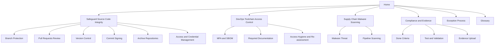

# Development Security Wiki

Practical, easy-to-understand guidance for securing your software development lifecycle.

This wiki covers:

- Source code integrity controls
- DevOps toolchain access management
- Software supply chain protection
- Compliance evidence requirements
- Exception handling

---

## Page Map

---

## Quick Links

| Page | Purpose |
|------|---------|
| [Safeguard Source Code Integrity](Safeguard-Source-Code-Integrity) | Branch protection, PR review, credentials |
| [DevOps Toolchain Access Control](DevOps-Toolchain-Access-Control) | Tool access, SBOM, MFA, re-assessment |
| [Supply Chain Malware Scanning](Software-Supply-Chain-Malware-Scanning) | Pipeline malware scanning |
| [Compliance and Evidence](Compliance-and-Evidence) | Done criteria, validation, Sirius upload |
| [Exception Process](Exception-Process) | Non-compliance examples and process |
| [Glossary](Glossary) | Key terms explained |

---
